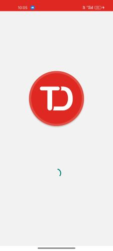
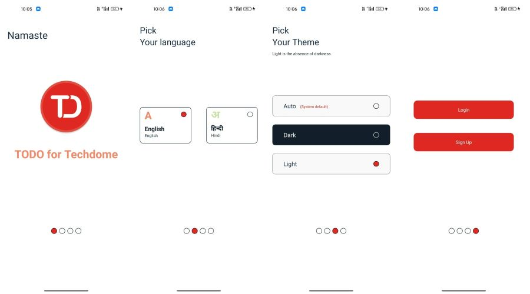
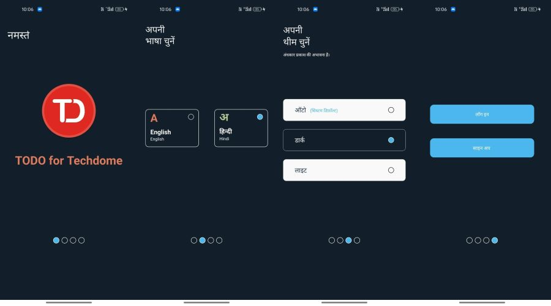
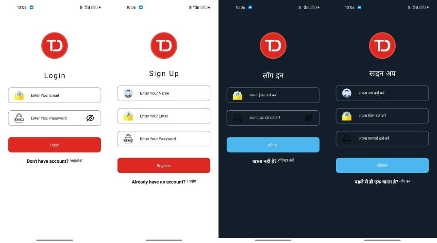
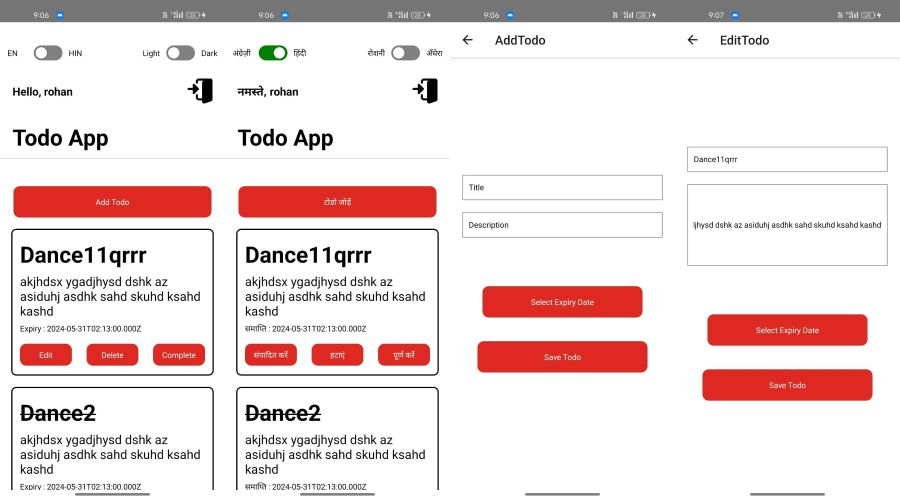

# Todo Application Created For TechDome

## Description

This is a todo application built using React Native. It allows users to create, edit, and delete tasks, as well as toggle between light and dark themes and switch between English and Hindi languages.

## Features

- Create multiple accounts and maintain their Todo list data
- Create, edit, and delete tasks
- Toggle between light and dark themes
- Auto theme option which will adapt accordingto phone's default theme
- Switch between English and Hindi languages
- Splash swiper containing of 4 pages

## Test Credentials

- Email - test@user.com
- Passwoerd - 1234567

## Requirements

- Node.js
- React Native
- Packages listed in `package.json`

## Installation

1. Clone the repository:

   ```bash
   git clone <repository_url>

   ```

2. Install dependencies:

   ```bash
   npm install
   ```

## Usage

1. Run the application:

   ```bash
   npm start
   ```

## Configuration

- Theme: To change the default theme (light/dark), modify the theme , With auto option , applivation will adapt the phoone's default theme.

- Language: There is hindi and english lanuage support , Default language is English. (here i had to include only two languages , so i hame done it conditionally , but to include many languages , we should use separate JSON files with language data)

## Technolgies used

- React Native

## Packages used

- @react-native-async-storage/async-storage : AsyncStorage used to Maintain users data , and login as well as the todo's specific to users

- @react-native-community/datetimepicker : datetimepicker is used to select the expiry date of a todo task

- @react-navigation/native : This package is used to navigate between different pages

- @react-navigation/native-stack : we have used a stack navigator to navigate between pages

- @reduxjs/toolkit , react-redux : To manage state centrallay , and to implement the Language and Theme functionality , we have used the Redux

- react-native-toast-message : As we had less time , so instead of cretaing own toggle button i have used this package

- react-native-swiper : to create the Onboarding carousal , used this swiper package

- react-native-svg : To use svg's

- react-native-responsive-dimensions : to make the application responsive , used this package

- react-native-safe-area-context , react-native-screens : installed with the navigation package

## Folder Structure

- `src/` : Contains the source code of the application.

  - `components/` : Reusable UI components.
  - `Images/` : contains the images used in the app
  - `Redux/` : contains redux store and the slices
  - `Screens/` : All the page / screens are stored here
  - `AppNavigator.js`: file containing the stack navigation

- `App.js`: Entry point of the application.
- `screenshots`: All application pages screenshots are saved here

Wait for few seconds images to download

## First Splash screen page

<center></center>

## Onboarding Carousal : Light Theme and English language

<center></center>

## Onboarding Carousal : Dark Theme and Hindi language

<center></center>

## Login and sign up page

<center></center>

## Home page , Add and Edit Tdod page

<center></center>
